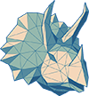
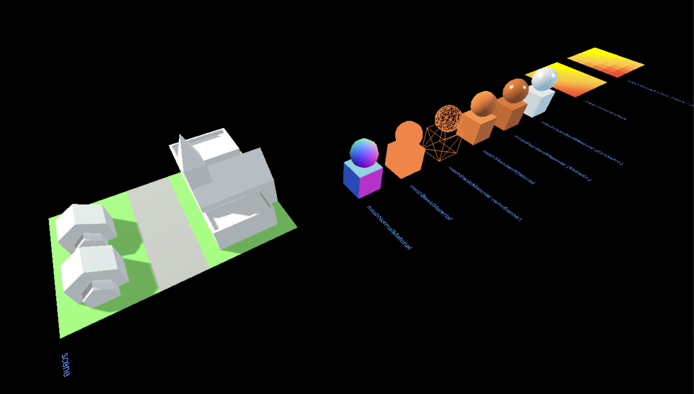

# Triceratops

Triceratops is a Grasshopper plugin that exports geometry from Grasshopper to a JSON file in the Three.js object scene format.

## Goals

Triceratops is a Grasshopper exporter made for web developers that use Three.js. Therefore, the intention is to create a Grasshopper plugin that exposes the Three.js object classes and their attributes while using terminology the mirrors that of Three.js. Many components represent specific Three.js object classes in both name and attributes. For instance, the component [MeshStandardMaterial](https://threejs.org/docs/#api/en/materials/MeshStandardMaterial) allows the user to create an object of this class and associate it a mesh object.

## Install

* Go to [Triceratops page at Food4Rhino](https://www.food4rhino.com/app/triceratops) and download the project .zip folder. 
* Extract the files from the .zip folder.
* Place the .gha file in your grasshopper components folder. This can be found from Grasshopper at:
  File > Special Folders > Components Folder

  or often at the following location on your C drive:
  C:\Users\[your username]\AppData\Roaming\Grasshopper\Libraries
* Restart, or start a new instance of Rhino/Grasshopper

## Output

The plugin produces as a JSON with using the [Three.js object scene format](https://github.com/mrdoob/three.js/wiki/JSON-Object-Scene-format-4). The resulting JSON objects can be loaded into a Three.js canvas using [THREE.ObjectLoader()](https://threejs.org/docs/#api/en/loaders/ObjectLoader).

## Supported Geometry

Currently, only meshes are supported. The exporter uses the [bufferGeometry](https://threejs.org/docs/#api/en/core/BufferGeometry) format for meshes.

## Tools

**Geometry**
*  **Mesh** builds a Three.js bufferGeometry object of type from mesh geometry. It requires a material input that is associated with the mesh.
*  **MeshVertexColors** builds a Three.js mesh object with vertex colors.
*  **MeshColorFaces** unwelds all mesh edges and colors vertices based on mesh faces. 

**Materials**
*  **MeshNormalMaterial** creates a Three.js material object of the meshNormalMaterial type. This material colors mesh faces based on their normal.
*  **MeshBasicMaterial** creates a Three.js material object of the meshBasicMaterial type. This material gives a mesh a solid color that does not react to scene lighting or shadows. 
*  **MeshPhongMaterial** creates a Three.js material object of the meshPhongMaterial type. This material can simulate shiny materials and react to scene lighting and shadows.
*  **MeshStandardMaterial** creates a Three.js material object of the meshStandardMaterial class. This material uses physically based rendering to make a material that reacts to light in a realistic way.

**Scene**
*  **Scene** creates a Scene object from one or more mesh geometries.
*  **ExportJSON** creates a JSON string from a scene and saves it to a desired location.
*  **RelativePath** generates the file path to the location where the grasshopper is saved.

## Example Scene

The example scene demonstrates how to export meshes with various materials and settings.

## Development Environment

The plugin was developed in Visual Studio using the [Grasshopper plugin template](https://marketplace.visualstudio.com/items?itemName=McNeel.GrasshopperAssemblyforv6). The [Visual Studio project folder](https://github.com/meliharvey/Triceratops/tree/master/threejs-exporter) is included in this repository.

## Next steps

* line geometry component
* meshPhongMaterial component
* meshLambertMaterial component
* point light component
* directional light component
* area light component
* userData component to be fed into the mesh component (i.e for coloring meshes on the fly in the browser)
* camera component
